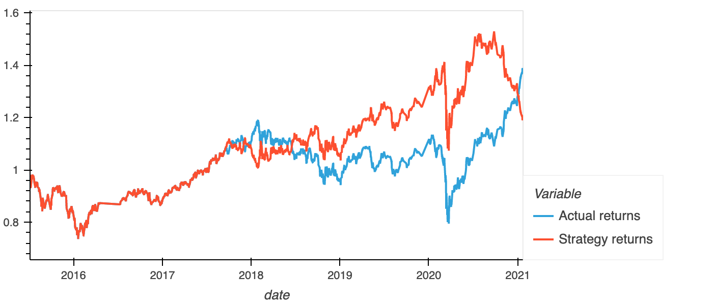

## Background
For this Challenge, you’ll assume the role of a financial advisor at one of the top five financial advisory firms in the world. Your firm constantly competes with the other major firms to manage and automatically trade assets in a highly dynamic environment. In recent years, your firm has heavily profited by using computer algorithms that can buy and sell faster than human traders.

The speed of these transactions gave your firm a competitive advantage early on. But, people still need to specifically program these systems, which limits their ability to adapt to new data. You’re thus planning to improve the existing algorithmic trading systems and maintain the firm’s competitive advantage in the market. To do so, you’ll enhance the existing trading signals with machine learning algorithms that can adapt to new data.

## Model Results
First simple strategy

Enhanced Logistic Regression ml model on above simple strategy

## Conclusion
This modified model was made with Logistic Regression. This model had a much better ROI than the first model we tried. You can see towards the end of the dataset that there was something unusal going on with the LR model results as the returns were shown to drop under the actual returns. not sure if this would be corrected with more data. For the main life of the strategy there was about a 20% in returns with the LR model in place. Pretty amazing results